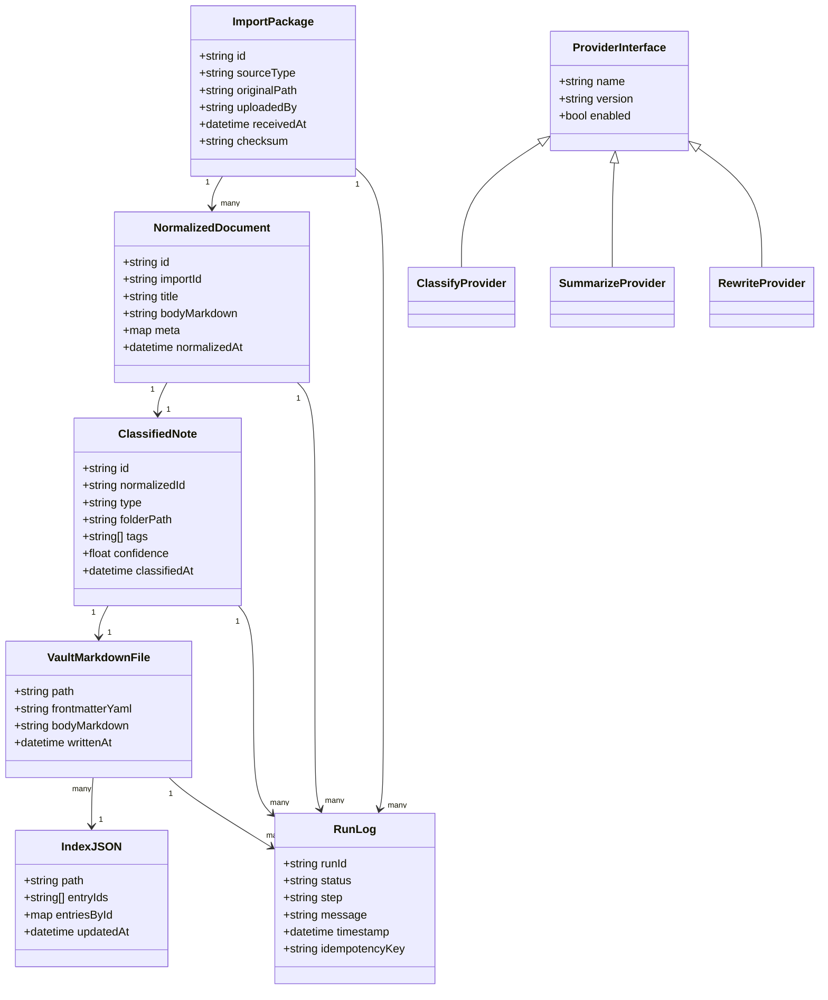

# Personal Knowledge Vault - System Diagrams

이 문서는 오늘 요청한 시스템 구조를 한눈에 이해하기 위해 작성했습니다. 파일 기반 MVP에서 어디에 어떤 데이터가 흐르고 남는지를 빠르게 확인하려는 목적이며, 과도한 텍스트로 성능/보안에 영향이 없도록 핵심만 요약했습니다.

## A) System Flow (Mermaid)

아래 다이어그램은 사용자의 입력부터 파일 기반 저장소까지의 전체 흐름을 보여줍니다. 각 단계의 출력 산출물과 오류/재시도 경로를 함께 표기했습니다.

```mermaid
flowchart LR
  %% User entry points
  U1[User: Notion Export] --> WUI[Web UI (Next.js)]
  U2[User: Write Note] --> WUI
  U3[User: Submit YouTube URL] --> WUI

  %% API and workers
  WUI -->|upload/export/submit| API[API Gateway (Node.js)]
  API -->|enqueue run| IMP[Import Processor]
  IMP -->|normalize| NORM[Normalizer]
  NORM -->|doc| ND[Normalized Document]

  %% Classification
  NORM --> CLS[Classifier]
  CLS -->|interface| CP[(ClassifyProvider)]
  CP -->|stub or AI| CLS
  CLS -->|result| CN[Classified Note]

  %% Persistence
  CN --> PERSIST[Persistor]
  PERSIST -->|write| VAULT[File Vault (MD + YAML)]
  PERSIST -->|append| IDX[Index JSON]

  %% Indexing
  PERSIST --> IDXER[Indexer]
  IDXER -->|update| IDX

  %% Optional rewrite (phase 2)
  CN -->|optional| RW[Rewrite/Wikiizer]
  RW -->|interface| RP[(RewriteProvider)]
  RW -->|rewrite| VM[Vault Markdown File]
  VM --> VAULT

  %% Summarize provider boundary (future / optional)
  CN -->|optional| SP[(SummarizeProvider)]

  %% Logs and idempotent runs
  API -->|create run| LOG[Run Logs]
  IMP -->|write status| LOG
  CLS -->|write status| LOG
  PERSIST -->|write status| LOG
  IDXER -->|write status| LOG
  RW -->|write status| LOG
  LOG -->|re-run/idempotent| IMP

  %% Error paths
  IMP -.->|error| LOG
  NORM -.->|error| LOG
  CLS -.->|error| LOG
  PERSIST -.->|error| LOG
  IDXER -.->|error| LOG
  RW -.->|error| LOG

  %% Future DB (not used in MVP)
  DB[(Postgres - Future)] -.-> API
```

## B) Domain/Data Model (Mermaid)

도메인/데이터 모델은 파일 기반 MVP에서 실제로 저장되는 아티팩트(문서, 인덱스, 로그)와 AI 제공자 인터페이스를 중심으로 구성했습니다.



## C) Element-to-Module Mapping (Short Notes)

아래는 다이어그램 요소가 코드 모듈로 어떻게 대응되는지 요약한 설명입니다. 실제 구현 모듈/패키지 이름은 영어로 유지합니다.

- Web UI (Next.js): UI forms for upload/write/URL submit; maps to `apps/web`.
- API Gateway (Node.js): request validation, run creation, orchestration; maps to `apps/api`.
- Import Processor: receives export packages and queues normalization; maps to `packages/importer` (new).
- Normalizer: converts Notion exports or raw note input to canonical Markdown + meta; maps to `packages/normalizer` (new).
- Classifier: determines type/folder/tags; maps to `packages/classifier` (new) using `ClassifyProvider` interface.
- Persistor: writes Markdown + YAML frontmatter into vault; maps to `packages/vault` (new).
- Indexer: maintains `index.json` for fast lookup; maps to `packages/indexer` (new).
- Rewrite/Wikiizer (phase 2): rewrites notes to wiki-style with links; maps to `packages/wikiizer` (future).
- Providers: adapters for Codex/Claude/Gemini; maps to `packages/ai-providers/*` (new).
- Run Logs: JSON lines or append-only log per run to ensure idempotency/replay; maps to `packages/run-logs` (new).
- File Vault: directory tree storing Markdown + YAML frontmatter and `index.json`; maps to `packages/vault` storage path.
- Postgres (future): optional persistence for metadata and search; not used in MVP.
