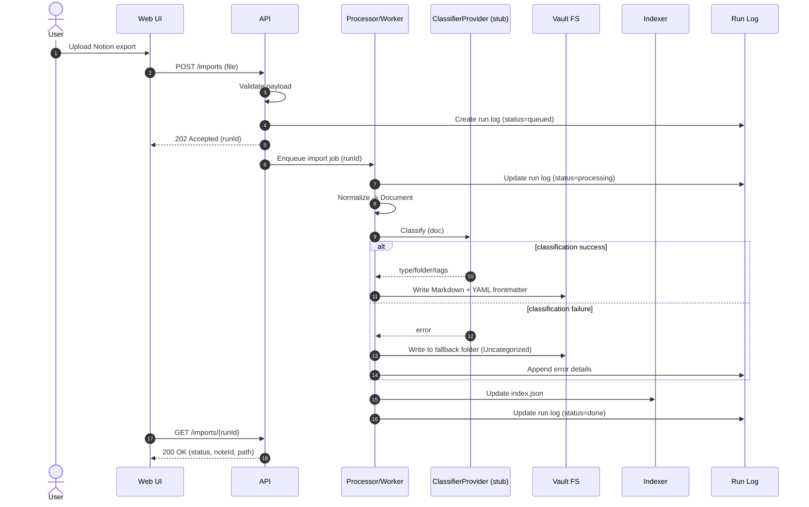
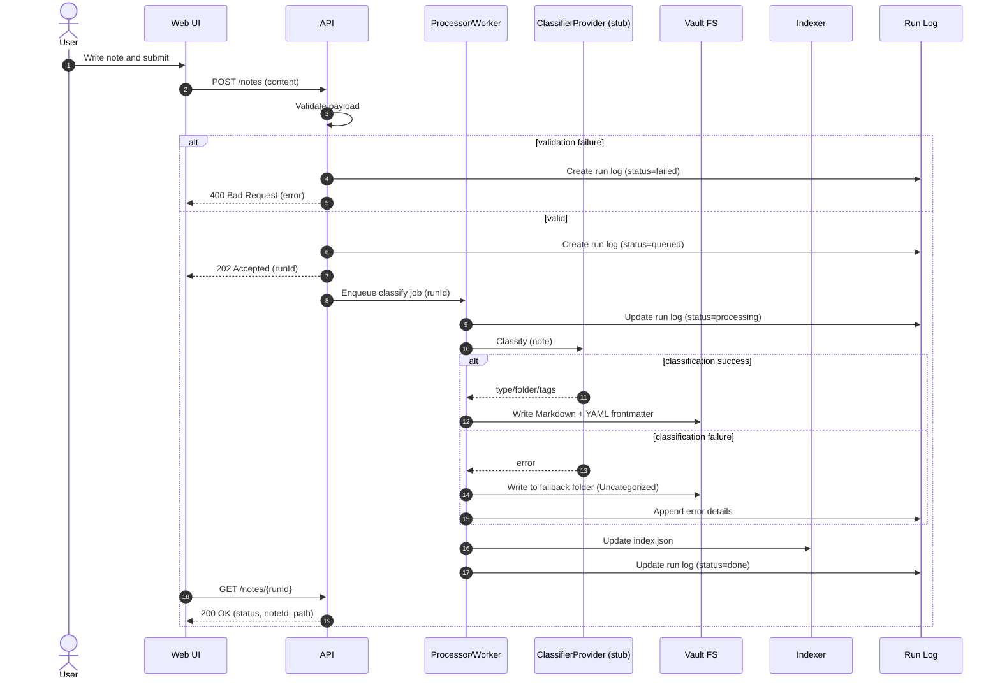
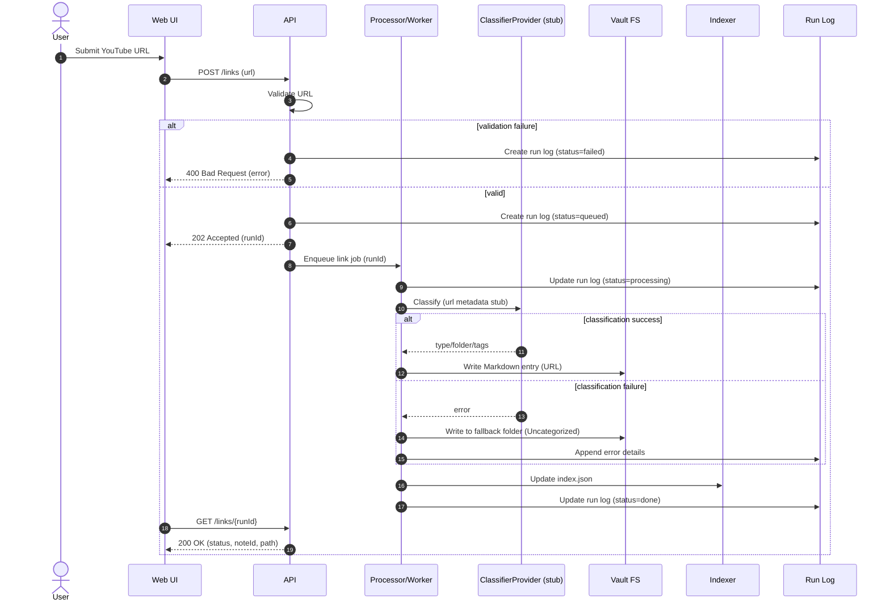

# Personal Knowledge Vault - UX Sequence Diagrams

이 문서는 유스케이스별 UX 흐름을 명확히 하려는 목적입니다. 사용자 입력부터 결과 응답까지의 상호작용만 간결히 담아, 이후 구현 시 빠르게 참조할 수 있도록 구성했습니다.

아래 시퀀스 다이어그램은 UI/UX 관점에서 각 유스케이스의 상호작용 흐름을 보여줍니다. 다이어그램 자체는 Mermaid로 유지하고, 설명은 한국어로 작성했습니다.

## UC1) Notion export import and classification

## UC2) Web note creation and auto-classification

## UC3) YouTube URL submission and classification

## Idempotency & Retry Notes

- 각 요청은 `runId`를 기준으로 로그에 기록하고, 동일한 `idempotencyKey`가 있으면 동일 작업을 재실행하지 않도록 설계합니다.
- Processor/Worker는 각 단계별 완료 상태를 Run Log에 기록해, 실패 시 특정 단계부터 재시작할 수 있습니다.
- 분류 실패 시에는 `Uncategorized` 폴더로 저장하여 데이터 유실을 방지하고, 이후 재분류 워크플로우로 복구합니다.
- UI는 `GET /{resource}/{runId}` 폴링으로 상태를 확인하며, 재시도는 동일 `runId` 또는 새 `runId`로 구분합니다.
